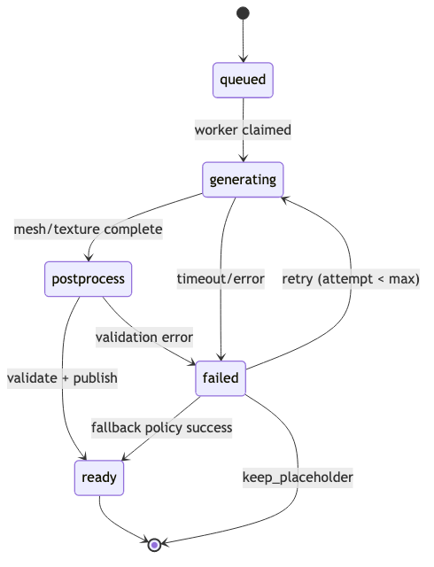
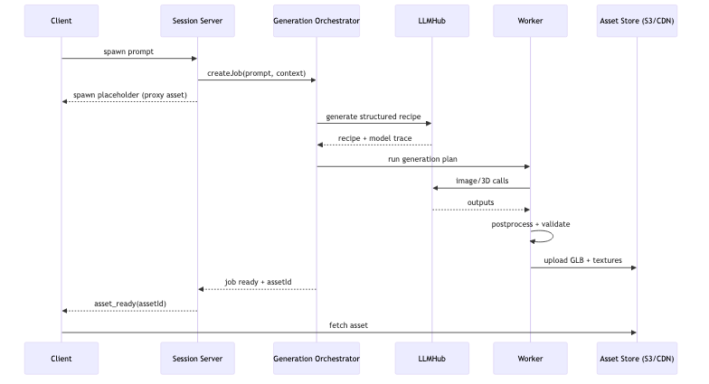

# Prompt-to-World Sandbox (Three.js) - Refined Design Spec v0.1

## 0. One-sentence product definition

A multiplayer 3D sandbox ("Forge-mode meets open-ended generation") where players type prompts to spawn interactive, physics-enabled objects/characters/structures into a shared world, then edit + save them as reusable prefabs in a library, with a web-first client and a WebView-free React Native client.

---

## 1. Product goals and constraints

### Core goals

1. Prompt -> playable object in seconds
   - Something appears immediately (even if it is a placeholder), then upgrades as assets finish generating.
2. Everything is editable
   - Every generated thing becomes an entity with tweakable parameters: transform, physics, materials, behaviors, and generation provenance.
3. Multiplayer parity
   - Everyone in the session sees the same result (same mesh, textures, physics setup), not "close enough".
4. Provider/model flexibility
   - Swap LLMs and image/3D generators without rewriting your engine.

### Product scope decisions

- Audience/use cases: creator sandbox plus game and social build space.
- V1 asset types: props, structures, characters, and terrain stamps.
- World persistence: persistent worlds (not session-only).

### Reality constraints (designing around them)

- "Generate any game asset on the fly" is feasible only with progressive fidelity:
  - Tier 0: instant procedural stand-in (primitives + basic material)
  - Tier 1: textures/sprites quickly
  - Tier 2/3: full 3D mesh + PBR + LODs (slower)
- Multiplayer consistency requires server-coordinated generation and asset distribution by ID, not each client generating independently.

---

## 2. Tech baseline

### Rendering

- three.js r182 / three@0.182.0 as your pinned baseline (latest as of Dec 2025).
- Default renderer: WebGLRenderer (broadest compatibility).
- Optional high-end path: WebGPURenderer on supported platforms (keep behind a capability flag; do not make it mandatory).

### Asset format

- Standardize on glTF 2.0 / GLB for runtime assets (broad tooling support + efficient web delivery).
- Use KTX2/Basis texture compression for web-scale performance where supported (mobile support can be tricky; see mobile section).

### Physics

- Use a WASM-friendly physics engine (e.g., Rapier is a common choice) so web + mobile can share most logic.

### Multiplayer networking

- WebSocket-based realtime transport (WebRTC optional later).
- Server authoritative world state + physics authority (at least for important interactions).

---

## 3. Game modes and camera/control spec

### Modes

1. Build / God Mode
   - Free-fly camera, grid snapping, transform gizmos, terrain sculpt/paint, prompt spawn, library browsing.
2. Play / Possess Mode
   - Take control of an NPC/avatar.
   - Standard WASD + mouse look (first-person or third-person).
   - Physics interactions: pick up, throw, drag, stack.

### Mode switching rules

- A single session can allow both modes; optionally enforce build-only or play-only rooms.
- Possession is a camera + input binding + entity ownership change, not a separate scene.

---

## 4. System architecture (high-level)

### Clients (Web + RN native)

- Engine Core (shared TS package)
- ECS / entity graph
- Input mapping (mode-based)
- Physics wrapper
- Asset streaming + caching
- Multiplayer replication client
- Renderer adapter
  - Web: canvas + WebGL/WebGPU
  - Mobile: Expo GL or RN WebGPU (details below)
- UI layer
  - Prompt box
  - Generation queue/status
  - Inspector panel (parameters)
  - Library browser
  - Multiplayer lobby + social

### Backend services

1. Realtime Session Server
   - rooms, players, authority, replication, interest management
2. Asset Library Service
   - metadata DB + object storage (CDN) for GLBs/textures
3. Generation Orchestrator
   - turns prompts into jobs; selects providers; produces finalized assets (safety checks optional; not in MVP)
4. Worker pool
   - GPU workers (cloud) and optional local workers (user-run)

---

## 5. Data model (what you persist and replicate)

### Entity (runtime)

- entityId
- assetId (or procedural recipe id)
- transform (pos/rot/scale)
- physics (body type, mass, friction, restitution, gravityScale)
- render (material overrides, tint, LOD policy)
- interaction (pickupable, throwable, damageable, etc.)
- behavior (optional: finite state / behavior tree / script reference)
- ownership (clientId / server)

### AssetDefinition (library + CDN-backed)

- assetId
- displayName
- prompt + negativePrompt
- generationRecipe (structured JSON)
- providerTrace (models + versions + settings used)
- files (GLB URL, textures, thumbnails, collision mesh, LODs)
- defaultParams (spawn defaults)
- tags (prop / structure / character / terrain stamp / etc.)
- license/terms metadata (store for compliance; provider-dependent)

### GenerationJob (async)

- jobId, requestedBy, roomId
- input (prompt + references)
- status (queued -> generating -> postprocess -> ready/failed)
- attempts, maxAttempts
- timeoutMs, lastError
- fallbackPolicy (e.g., "downgrade", "procedural_only", "keep_placeholder")
- resultAssetId (when done)

---

## 6. Prompt-to-asset pipeline (end-to-end)

The key is progressive spawn with a consistent recipe object that can be rehydrated.

### Step A - Intent interpretation (LLM -> structured recipe)

**Input**

- user prompt
- current world context (style, scale unit, allowed categories, performance budget)
- optional reference images
- optional room style guide (e.g., "Halo-like sci-fi", "lowpoly", "photoreal")

**Output**

- a strict JSON recipe, e.g.:

```json
{
  "kind": "prop|structure|character|terrain_stamp",
  "name": "Rusty forklift",
  "scaleMeters": [2.1, 1.4, 3.2],
  "style": "semi-realistic, worn paint, industrial",
  "materials": [
    { "type": "painted_metal", "roughness": 0.7 },
    { "type": "rubber", "roughness": 0.9 }
  ],
  "physics": { "body": "dynamic", "massKg": 850, "collider": "convex_hull" },
  "interaction": { "pickup": false, "pushable": true },
  "generationPlan": {
    "meshStrategy": "text_to_3d|image_to_3d|procedural",
    "textureStrategy": "pbr_from_image|generated_pbr|flat",
    "lods": true
  }
}
```

**Why this matters**

- Every later step is deterministic relative to this recipe (plus seeds / model versions).

### Step B - Immediate placeholder spawn (0-200ms)

Spawn something instantly:

- A box/capsule proxy at correct size
- A simple generated material (color + roughness) or a standard missing-texture placeholder
- Temporary collider (bounding box)

This keeps gameplay responsive even while the asset pipeline runs.

**Failure + retry rules**

- If a job times out or fails, keep the placeholder and mark the entity as `generation_failed` with a visible badge and retry button.
- Retry up to `maxAttempts`, then apply `fallbackPolicy`:
  - downgrade: shift to a cheaper/faster model or procedural mesh strategy
  - procedural_only: always succeed with a parametric proxy + generated textures
  - keep_placeholder: stop retries, keep proxy and save error context for debugging
- Partial outputs (e.g., mesh without textures) are allowed; ship them with a "draft" flag and continue attempting missing steps in the background.

### Step C - Asset generation strategies (choose per recipe)

You should support multiple mesh strategies behind one interface:

**Strategy 1: Procedural geometry (fast, reliable)**

Best for: primitives, simple props, blocky structures, quick prototypes

- Build meshes from parametric templates (extrusions, lathe, CSG-like ops, modular kit pieces).
- Materials from generated textures (see Nano Banana below).

**Strategy 2: Text -> 3D provider API (higher fidelity, slower)**

Best for: unique props, statues, themed structures

- Example: Meshy Text-to-3D API uses a preview stage then refine stage (good match for your placeholder -> finalize flow).
- Similar providers exist (Tripo, etc.), but keep them as swappable adapters.

**Strategy 3: Text -> image -> image-to-3D (more controllable composition)**

Best for: you want control + reproducibility across providers

Pipeline:

1. generate a reference render image (or 3-4 views)
2. reconstruct mesh from image(s)
3. re-texture / refine

For image-to-3D:

- Stable Fast 3D (single image -> 3D, fast)
- TripoSR (open-source image -> 3D reconstruction)
- For open-source model alternatives, track options like Tencent's Hunyuan3D-2.0 open-source models (per Reuters) as candidates for your local/hosted worker fleet.

**Strategy 4: Unreal Engine MCP offline/creator pipeline (highest control, not runtime)**

Best for: high-end asset production, curated libraries, or host runs a powerful generator machine

- MCP can let an AI client control Unreal Editor for placing actors, importing assets, running scripts, etc. (e.g., community Unreal MCP servers exist).

This is best treated as a creator toolchain, not your core runtime dependency for web/mobile.

**Strategy selection mapping (from generationPlan to provider)**

- meshStrategy = procedural
  - Use procedural geometry templates + LLMHub image model for textures.
- meshStrategy = text_to_3d
  - Use LLMHub 3D model if available; otherwise route to a provider adapter (e.g., Meshy) via LLMHub passthrough.
- meshStrategy = image_to_3d
  - Use LLMHub image model to generate the reference views, then use an LLMHub 3D model or adapter for reconstruction.
- textureStrategy = generated_pbr
  - Use LLMHub image model to output albedo/roughness/metallic or a packed PBR set.
- textureStrategy = pbr_from_image
  - Use LLMHub image-edit model to derive PBR maps from a source texture.
- textureStrategy = flat
  - Use a single-color or small palette material to keep budgets low.

### Step D - Texture and sprite generation (LLMHub image models)

Use LLMHub image generation/editing models for:

- thumbnails
- albedo/roughness/metallic maps (or stylized textures)
- decals (signs, posters, labels with legible text)
- billboard sprites (grass clumps, VFX cards, distant impostors)

**LLMHub requirement**

- LLMHub must include at least one image generation module (e.g., Gemini image models) so this step stays within the unified gateway.

Per Google's Gemini API docs (example image module):

- Nano Banana refers to Gemini 2.5 Flash Image (gemini-2.5-flash-image) optimized for speed/efficiency.
- Nano Banana Pro refers to Gemini 3 Pro Image Preview (gemini-3-pro-image-preview) aimed at professional asset production and can generate up to higher resolutions (docs include up to 4K tables).

**Practical usage recommendation**

- Flash Image for quick iteration textures (fast, cheaper, lots of calls)
- Pro Image for final textures, decals, UI art, and anything needing crisp text or complex multi-step instruction following (slower, pricier)

### Step E - Post-processing (make it game-ready)

Regardless of upstream provider, standardize a post-process stage:

**Execution location**

- Run heavy post-process steps in the worker pool (GPU/CPU), then have the server validate and register artifacts before publishing.

**Target budgets (PS2-era fidelity, adjust per platform)**

- Props: LOD0 300-1,500 tris, LOD1 150-700, LOD2 50-300
- Characters: LOD0 2,000-5,000 tris, LOD1 1,000-2,500, LOD2 300-1,000
- Structures: LOD0 2,000-12,000 tris, LOD1 1,000-5,000, LOD2 300-2,000
- Textures: 128-256 px for most props, 256-512 px for characters/hero props, 512 px max for structures

1. Normalize
   - scale to meters
   - pivot at ground contact or center of mass
   - face winding, normals, tangents
2. Mesh optimization
   - triangle reduction (LODs)
   - meshopt / Draco where appropriate
3. Materials
   - enforce PBR conventions
   - optionally bake to simpler materials for mobile
4. Collision
   - generate colliders (box / convex hull / simplified mesh)
   - compute mass properties from density or bounding volume
5. Packaging
   - output GLB + texture bundle
   - generate preview thumbnail + wireframe preview
6. Validation
   - poly/texture budget checks
   - "does it render?" sanity render on worker

### Step F - Integration and replication

- Server registers the assetId, stores binaries in object storage, then broadcasts:
  - spawnEntity(assetId, transform, physicsOverrides, instanceParams)
- Clients stream the final asset from CDN and replace placeholder seamlessly.
- Generation Orchestrator emits job progress events (queued/generating/postprocess/ready/failed) and percent progress where available.
- When assets are ready, the server emits `asset_ready` with assetId + version; clients swap from placeholder and clear draft badges.

---

## 7. Model/provider flexibility (how to design the code)

### Core principle

Treat all AI as pluggable providers behind capability-based interfaces.

### Suggested provider interfaces (TypeScript shape)

```ts
export type Capability =
  | "structured_json"
  | "image_generate"
  | "image_edit"
  | "text_to_3d"
  | "image_to_3d";

export interface ProviderBase {
  id: string; // "google-gemini", "local-ollama", "meshy", ...
  capabilities: Set<Capability>;
  healthcheck(): Promise<void>;
}

export interface TextProvider extends ProviderBase {
  generateStructured<T>(args: {
    schema: unknown; // JSON schema / zod->json schema
    prompt: string;
    context?: Record<string, any>;
    temperature?: number;
  }): Promise<T>;
}

export interface ImageProvider extends ProviderBase {
  generateImage(args: {
    prompt: string;
    negativePrompt?: string;
    aspectRatio?: string; // e.g., "1:1", "16:9"
    size?: "1K" | "2K" | "4K";
    seed?: number;
    inputImages?: Array<{ mime: string; data: Uint8Array }>;
  }): Promise<{ mime: string; data: Uint8Array }>;
}

export interface MeshProvider extends ProviderBase {
  textToMesh?(args: { prompt: string; seed?: number }): Promise<Uint8Array>; // GLB bytes
  imageToMesh?(args: {
    images: Array<{ mime: string; data: Uint8Array }>;
  }): Promise<Uint8Array>;
}
```

### LLMHub integration (unified gateway for all model types)

Assuming `jamesvolpe/web/llmhub` is extended to support all major model types (text, image, audio, video, embeddings, and 3D), treat it as your single integration surface and map it to the capability interfaces above.

**Model types to cover (assumed LLMHub extensions)**

- Text/chat: prompts, structured JSON, tool-use/function calling.
- Image: generate + edit (input images), thumbnails, texture maps.
- 3D: text-to-3D and image-to-3D (GLB/mesh outputs).
- Audio: speech-to-text and text-to-speech (optional for narration or UI).
- Video: short preview clips or turntables (optional for asset previews).
- Embeddings/rerank: asset search, similarity, and style matching.

**Integration pattern**

1. Use LLMHub as the only outbound AI client in the backend (Generation Orchestrator + optional local worker).
2. On startup, query LLMHub for model metadata (id, provider, modalities, max size, pricing tier) and build a local capability map.
3. Implement `TextProvider`, `ImageProvider`, and `MeshProvider` as thin adapters that call LLMHub with a `model` id + `modality`, then normalize outputs into your internal types.
4. Store the LLMHub model id and provider in `providerTrace` so assets are reproducible across environments.
5. Use the same LLMHub adapter on web or mobile only when you explicitly allow client-side calls (most asset generation remains server-side for consistency).

**Model routing configuration (example shape)**

```json
{
  "llmhub": {
    "baseUrl": "https://llmhub.yourdomain.com",
    "apiKeyEnv": "LLMHUB_API_KEY"
  },
  "models": {
    "intent": "text-best",
    "imageDraft": "image-fast",
    "imageFinal": "image-pro",
    "textTo3d": "3d-quality",
    "imageTo3d": "3d-fast",
    "embed": "embed-small"
  }
}
```

**Capability mapping to pipeline steps**

- Step A (intent parsing): LLMHub text model with structured JSON output.
- Step D (textures/decals): LLMHub image model (generate/edit).
- Step C (mesh generation): LLMHub 3D model(s) if available; otherwise keep external provider adapters and bridge them through LLMHub as passthroughs.
- Library search + style matching: LLMHub embeddings + rerank.

This keeps your engine code provider-agnostic while giving you a single place to add new models or swap vendors.

### Provider selection policy

Per job, choose a pipeline based on:

- requested asset type (character vs prop vs structure)
- latency tier (draft vs final)
- platform target (web vs mobile)
- cost budget / quota
- local-only privacy mode
- LLMHub model availability + capability map (preferred if present)

---

## 8. Gemini Nano Banana vs local models (practical comparison)

### Clarify the naming

- Nano Banana (Gemini API) = Gemini-native image generation/editing models:
  - gemini-2.5-flash-image (fast) and gemini-3-pro-image-preview (pro).

### Where Nano Banana shines (for your game)

- Fast generation of:
  - textures, decals, icons, thumbnails
  - style-consistent sprite sheets
  - iterative edits (prompt-to-edit workflows)
- Great fit for a web pipeline because it is already API-shaped and supports conversational refinement.

### Where local LLMs shine

- Intent parsing and recipe generation (structured JSON)
- Low-stakes generation logic:
  - naming, tagging, classification
  - generating procedural geometry parameters
- Benefits:
  - lower marginal cost
  - privacy (especially for user-uploaded references)
  - offline or degraded connectivity mode

### Where local image/3D models get hard

- For web + mobile, heavy image/3D models typically require:
  - GPU, memory, and packaging complexity
  - careful distribution, quantization, and device capability checks
- Best approach: support local generation as an optional worker (desktop app / docker / LAN host), while cloud providers handle baseline.

---

## 9. Multiplayer design (Forge-grade consistency)

### Server authority model

- Use standard competitive game patterns: server authoritative for shared physics/object state, client prediction + reconciliation for player movement and local input.
- Server is the source of truth for:
  - entity list
  - transforms (for important objects)
  - physics for shared interactions (at least pick-up/throw/stack)
  - asset IDs used in the session

### Deterministic asset sharing rule

- Only the server finalizes the asset and assigns an assetId.
- Clients never re-generate the asset from prompt during multiplayer; they only stream by assetId.

### Room size and persistence

- Target up to 5 concurrent players per room.
- Worlds are persistent; server state survives beyond a single session.

### Replication strategy

- Use standard modern game tick rates and interest management defaults; tune after profiling.

### Interest management

- Chunk the world (terrain chunks + entity spatial hashing)
- Clients subscribe to nearby chunks
- Replicate:
  - high-frequency for nearby dynamic physics objects
  - low-frequency or event-based for static objects

### Developer visibility

- Build a dev UI that exposes replication state, authority, and asset/job pipeline status for debugging consistency.

---

## 10. Terrain and landscaping tools (grid ground)

### Recommended terrain representation (web-friendly)

Chunked heightmap terrain (grid-based) for baseline:

- Sculpt brushes: raise/lower, smooth, flatten, noise, terrace
- Paint layers: grass/rock/sand (splat mapping)
- Stamp system: terrain_stamp assets generated from prompts (e.g., "a crater", "a hill with a cave entrance")

Optional later:

- voxel terrain for destructibility (more complex netcode + meshing)

### Multiplayer replication

- Terrain edits replicated as:
  - brush operations (deterministic) or
  - heightmap deltas per chunk

---

## 11. UI spec (minimum viable + scalable)

### Panels

1. Prompt Panel
   - prompt input
   - draft vs final toggle
   - provider selection (auto/manual)
   - style presets (lowpoly, realistic, toon)
2. Generation Queue
   - status + progress + cancel
   - shows placeholder -> preview -> refined states
3. Inspector (Unity-like)
   - Transform: position/rotation/scale + grid snap
   - Physics: body type, mass, gravityScale, friction, restitution
   - Rendering: material overrides, tint, shadow flags
   - Behavior: pickupable, breakable, AI brain type (future)
   - Provenance: prompt, seed, model/provider, version
   - Generation parameters: up to ~20 AI-provided fields mapped to inspector controls
4. Library
   - saved assets, tags, search
   - save current selection as prefab
   - version history + variants
   - publish/unpublish between local and shared libraries; remove from either

---

## 12. Mobile app strategy (WebView-free RN)

You have two viable directions:

MVP decision: choose Option A (Expo GL + three.js). Target modern/high-end devices; low-end support is not a priority.

### Option A - Expo GL + three.js (WebGL on native)

- expo-three exists specifically to bridge Three.js to Expo GL (native OpenGL ES context).
- expo-gl provides GLView as an OpenGL ES render target for 2D/3D graphics.

**Pros**

- Conceptually closest to three.js everywhere
- Works without WebView
- Lots of existing patterns

**Cons**

- You will hit platform quirks (asset loading, texture formats, KTX2 edge cases, etc.) and need careful testing.

### Option B - React Native WebGPU backend

- react-native-webgpu exists and notes that starting from three.js r168, Three.js runs out of the box with React Native WebGPU (with some Metro config adjustments).

**Pros**

- A more future-proof GPU path
- Better alignment with modern three.js WebGPU work

**Cons**

- More systems engineering: native modules, build complexity, device support variability

### Pragmatic recommendation

- Start with Option A for MVP mobile (fastest path).
- Keep a parallel WebGPU spike branch if you want long-term performance headroom.

---

## 13. Safety, abuse, and cost controls (initial policy)

Initial policy for MVP: no moderation or content scanning.

- Quotas and rate limits per user/room (reasonable defaults; no limits for admins)
- Caching + dedupe
- Content-addressed storage: hash recipe + seeds + model versions
- Audit trail
- prompts + provider trace saved with assets

---

## 14. MVP milestone plan (so this is buildable)

Definition of done for MVP 0-2: everything listed below is implemented end-to-end, not a partial prototype.

### MVP 0 - Core sandbox (no AI)

- three.js scene + lighting + grid ground
- fly camera + FPS camera
- pick up/throw with physics
- basic terrain sculpt (raise/lower)

### MVP 1 - Prompt -> structured recipe -> procedural spawn

- LLM outputs JSON recipe
- spawn procedural primitives + parameters
- inspector edits + save to local library

### MVP 2 - Prompt -> textures (Nano Banana)

- generate thumbnails + simple textures
- apply to primitives, decals, sprites
- Use gemini-2.5-flash-image for speed, keep gemini-3-pro-image-preview for final.

### MVP 3 - Prompt -> 3D mesh pipeline (one provider)

- integrate one text-to-3D API OR image-to-3D worker
- add postprocess + GLB packaging

### MVP 4 - Multiplayer alpha

- rooms, authoritative entity list, physics replication for interactables
- server-coordinated generation + assetId distribution

### MVP 5 - Mobile alpha (WebView-free)

- Expo GL + three.js
- shared engine core package

---

## 15. Optional Unreal Engine MCP integration (where it fits)

Treat this as a creator/pro pipeline, not a dependency of your runtime:

- If you want ultra high fidelity asset creation, a hosted Unreal Editor can be controlled via MCP-style integrations (community implementations exist), letting an AI agent assemble scenes, import assets, or generate blueprints.
- Output still gets exported to GLB and served through your normal library pipeline.

---

## 16. API contracts + generation job lifecycle

### Diagrams (PNG)





### Core endpoints (REST)

- `POST /v1/jobs`
  - Creates a generation job and returns a job id plus placeholder spawn info.
  - Requires `Idempotency-Key` header to avoid duplicate jobs.
- `GET /v1/jobs/{jobId}`
  - Returns job status, progress, and result asset id when ready.
- `POST /v1/jobs/{jobId}/cancel`
  - Cancels a job if it is still running.
- `POST /v1/jobs/{jobId}/retry`
  - Retries a failed job (subject to `maxAttempts`).
- `GET /v1/assets/{assetId}`
  - Returns the `AssetDefinition` metadata.
- `GET /v1/assets/{assetId}/download`
  - Returns signed URLs for GLB + texture bundles.

### Job creation (request/response)

```json
{
  "roomId": "room_123",
  "prompt": "a rusty forklift with worn paint",
  "assetType": "prop",
  "generationPlan": {
    "meshStrategy": "text_to_3d",
    "textureStrategy": "generated_pbr",
    "lods": true
  },
  "references": [{ "mime": "image/png", "url": "https://..." }],
  "draft": true,
  "clientRequestId": "req_abc123"
}
```

```json
{
  "jobId": "job_456",
  "status": "queued",
  "placeholder": {
    "assetId": "asset_proxy_789",
    "entityId": "ent_321",
    "scaleMeters": [2.1, 1.4, 3.2]
  },
  "fallbackPolicy": "downgrade",
  "maxAttempts": 2
}
```

### Job status (response)

```json
{
  "jobId": "job_456",
  "status": "generating",
  "attempts": 1,
  "progress": 0.4,
  "resultAssetId": null,
  "lastError": null
}
```

### WebSocket events (realtime)

- `job_progress`
  ```json
  {
    "type": "job_progress",
    "jobId": "job_456",
    "status": "postprocess",
    "progress": 0.8,
    "detail": "meshopt_lods"
  }
  ```
- `job_failed`
  ```json
  {
    "type": "job_failed",
    "jobId": "job_456",
    "error": "timeout",
    "fallbackPolicy": "downgrade"
  }
  ```
- `asset_ready`
  ```json
  {
    "type": "asset_ready",
    "jobId": "job_456",
    "assetId": "asset_999",
    "entityId": "ent_321",
    "version": 1
  }
  ```

### Lifecycle rules (summary)

- Status transitions follow the diagram above; `failed` may retry up to `maxAttempts`.
- `progress` is optional and may be coarse-grained (0.0, 0.5, 1.0).
- Partial outputs (mesh or textures missing) can be published as `draft` assets and upgraded later.

---

## 17. Security + auth

### API auth model

- Use JWT-based auth (Cognito or equivalent) for clients.
- API Gateway or edge proxy validates JWT; Session Server also verifies token on WebSocket connect.
- Service-to-service calls (Session Server -> Orchestrator -> LLMHub) use IAM roles or mTLS.

### Rate limits

- Global API throttles via API Gateway usage plans (per API key or per user id).
- Per-user and per-IP throttles enforced at edge (WAF) plus server-side checks.
- Burst limits are separate from sustained rate (e.g., 10 req/sec burst, 1 req/sec sustained).

### Per-room quotas

- Max concurrent players per room (default 5).
- Max concurrent generation jobs per room (default 2).
- Max job submissions per user per minute (default 5).
- Storage caps per room (asset count or total bytes), enforced on save/publish.

### Asset ownership + permissions

- `AssetDefinition` includes `ownerId`, `visibility` (private | room | org | public), and `editors`.
- Only `ownerId` or `editors` can modify, delete, or publish.
- Room-shared assets can be spawned by anyone in the room but cannot be edited unless granted.
- Downloads use signed URLs; access to signed URLs is gated by auth + visibility rules.

---

## 18. Deployment spec (AWS, scale-to-zero)

### Scale-to-zero goals

- No always-on compute for idle rooms.
- GPU workers only run when jobs are queued.
- Persistent data stored in serverless services (S3, DynamoDB).

### Core services (recommended)

- **Web client**: S3 + CloudFront (static hosting, pay per request).
- **API control plane**: API Gateway (HTTP + WebSocket) + Lambda.
- **Session Server**: ECS Fargate (primary runtime), tasks launched on demand per active room group.
- **Generation Orchestrator**: Lambda + SQS + Step Functions for job state.
- **Worker pool**: AWS Batch (EC2 GPU) with min vCPU = 0, Spot preferred.
- **Asset storage**: S3 (GLB + textures) + CloudFront CDN.
- **Metadata**: DynamoDB (on-demand capacity).
- **LLMHub**: ECS Fargate service; scale to 0 based on queue depth.

**Decision**

- Use ECS Fargate for realtime sessions; do not use GameLift for MVP.

### Request flow (scale-to-zero friendly)

1. Client connects (WebSocket) via API Gateway.
2. If a room is cold, a Lambda "room broker" starts an ECS task and returns the task endpoint.
3. Session Server reads world state from DynamoDB, then accepts clients.
4. Generation jobs are enqueued in SQS; workers spin up only when the queue has messages.
5. When a room is empty for N minutes, the ECS task shuts down and writes final state back to DynamoDB.

### Cost control levers

- Use external providers via LLMHub for heavy generation to avoid idle GPU spend.
- Set AWS Batch compute environment minimum to 0; use Spot for GPU.
- Use CloudFront for asset delivery (S3 origin) to reduce egress costs.
- Prefer DynamoDB on-demand to avoid provisioned idle cost.

### Operational notes

- Expect cold starts for Lambda and ECS tasks; surface "room warming" status in UI.
- Keep infra in a single region for lower latency; replicate assets cross-region only if needed.
- Use budgets + alarms (CloudWatch + AWS Budgets) to cap unexpected spend.

---

## North star architectural decision

Make generation an async job that yields a stable assetId, and make every client only ever load by assetId (never regenerate during multiplayer). This single rule prevents almost all desync-by-AI pain.
